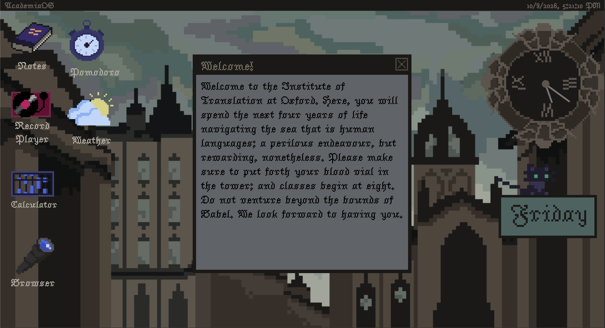
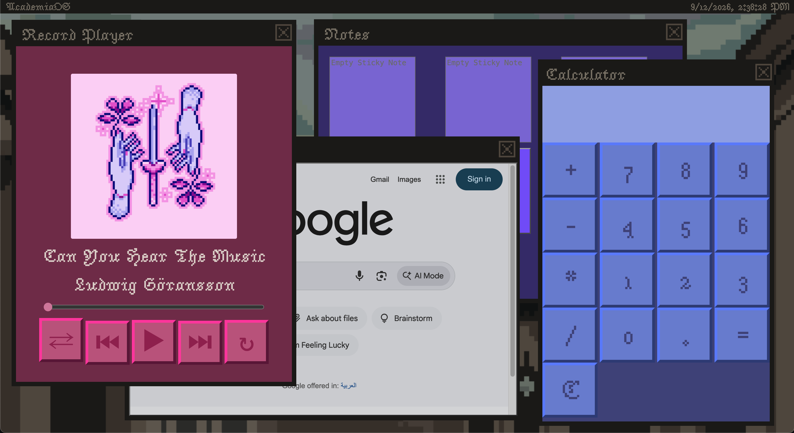
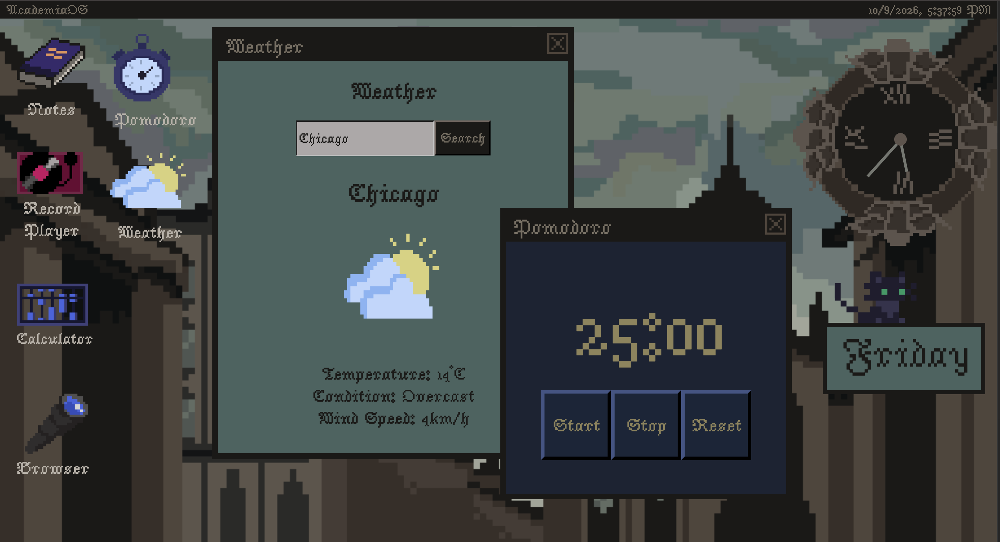

# AcademiaOS
AcademiaOS is my own web-based operating system loosely inspired by a dark academia aesthetic.

## What I used:
I used HTML, CSS and Javascript. This is my first javascript project so the functionality here is relatively simple. I used libesprite to design the background and all the icons. 
I used google fonts for all the text.

## Concept
Ive been wanting to try pixel art forever, and I recently read Babel which is a dark academia book so I merged the two together to create this project. I spent around 5 hours on all the art. I kept all my tabs and buttons rectangular to fit with the aesthetic. I couldnt figure out how to convert the google browser to dark mode so i just inverted the colors. The inverted color images might look concerning, but at least it matches with the rest of the site am i right.

For WebOS2 i went a step up and designed an antique clock widget as well as my first mini cat animation that i added as a gif on top of the weekday widget. All in all thats about 2 more hours on the pixel art.
I also learned how to retrieve data such as weather conditions for the weather app in javascript.

## What I included:
- welcome tab: babel reference because why not
- notes app: to keep track of your thoughts while studying
- record player: includes some of my favourite instrumentals
- calculator
- browser

#### New features 
- pomodoro app
- weather app
- clock widget
- cat widget

Original Applications:

New Features:

## Tutorials I followed
Since it was my first javascript project it involved plenty of google searches and youtube tutorials so here's what i used to learn:
- <a href="https://www.youtube.com/watch?v=APjb5Er03UE">record player app</a>
- <a href="https://www.youtube.com/watch?v=I5kj-YsmWjM">calculator app</a>
- <a href="https://www.youtube.com/watch?v=Efo7nIUF2JY&t=1751s">notes app</a>
- <a href="https://www.youtube.com/watch?v=9DxdE__m_LA&t=151s">clock widget</a> 
    (This video in particular was very helpful as it went into detail regarding the math involved in rotating the clock hands.)
- the webOS guide on stardance

## Link to AcademiaOS:
Live Link: <a href="https://909aminoacid909.github.io/AcademiaOS/">https://909aminoacid909.github.io/AcademiaOS/<a>
